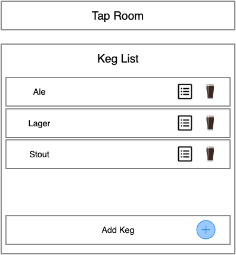

Tap Room

 ### By Joseph Pearce

## Description

Website for tracking kegs from a tap.

## User Stories 

* As a user, I want to see a list of all available kegs that show name, brand, price and alcoholContent. 
* As a user, I want to submit a form to add a new keg to a list.
* As a user, I want to be able to click on a keg to see its detail page.
* As a user, I want to see how many pints are left in a keg. A full keg has roughly 124 pints.
* As a user, I want to be able to click a button next to a keg whenever I sell a pint of it. This should decrease the number of pints left by 1. Pints should not be able to go below 0.

## Available Scripts

In the project directory, you can run:

### `npm start`

Runs the app in the development mode. 
Open [http://localhost:3000](http://localhost:3000) to view it in the browser.

The page will reload if you make edits. 
You will also see any lint errors in the console.

### `npm test`

Launches the test runner in the interactive watch mode. 
See the section about [running tests](https://facebook.github.io/create-react-app/docs/running-tests) for more information.

### `npm run build`

Builds the app for production to the `build` folder. 
It correctly bundles React in production mode and optimizes the build for the best performance.

The build is minified and the filenames include the hashes. 
Your app is ready to be deployed!

See the section about [deployment](https://facebook.github.io/create-react-app/docs/deployment) for more information.

## Learn More